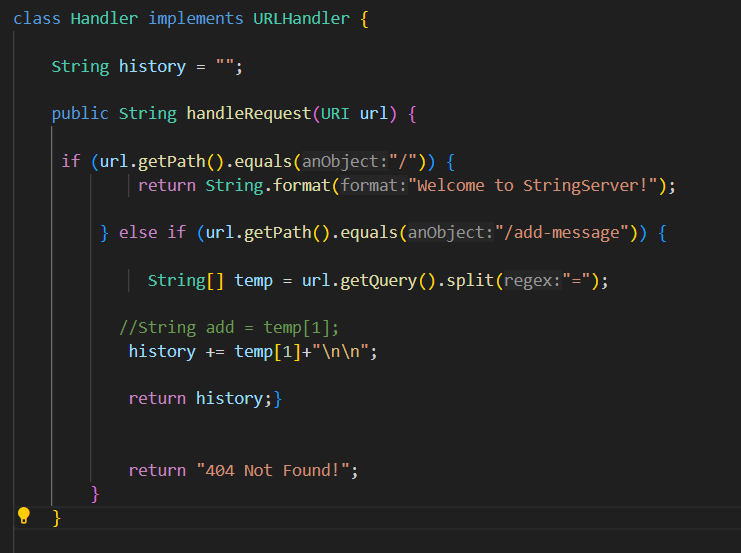
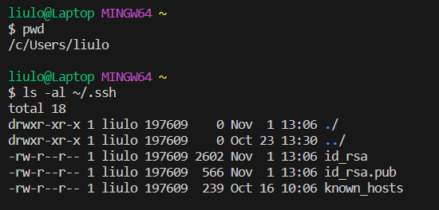
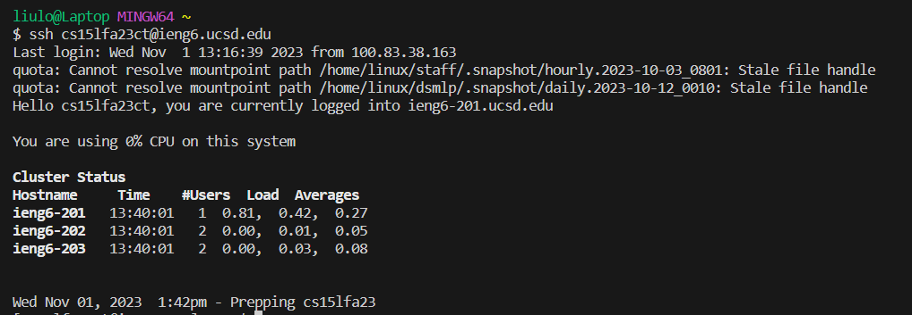

# Part 1:

I first used StringBuilder() to create a string to store all the words added. Then getPath() and contains() to see if the URL contains the word "/add-messages". Used split() to separate the URL. And store the word after the "=" to the String "history".

# Part 2:

# Part 3:

Most of the stuff we did in this two-week lab is new to me, like creating a web server, making md files, and using JUnit to debug, etc.
