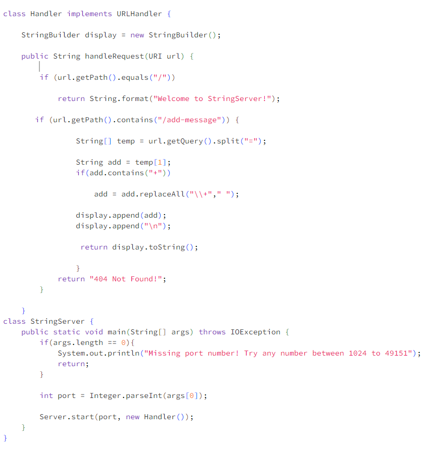
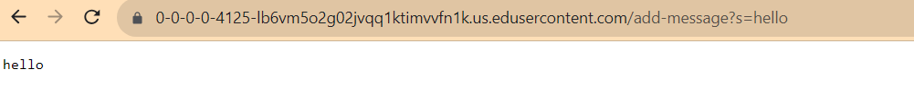

### Part 1:

-------

--------

----------

I first used StringBuilder() to create a string to store all the words added. Then getPath() and contains() to see if the URL contains the word "/add-messages". Used split() to separate the URL. And replaceAll() to replace the "+" to " ". Then used append() to store the word into the string, and last used toString() to print it on the screen. 
