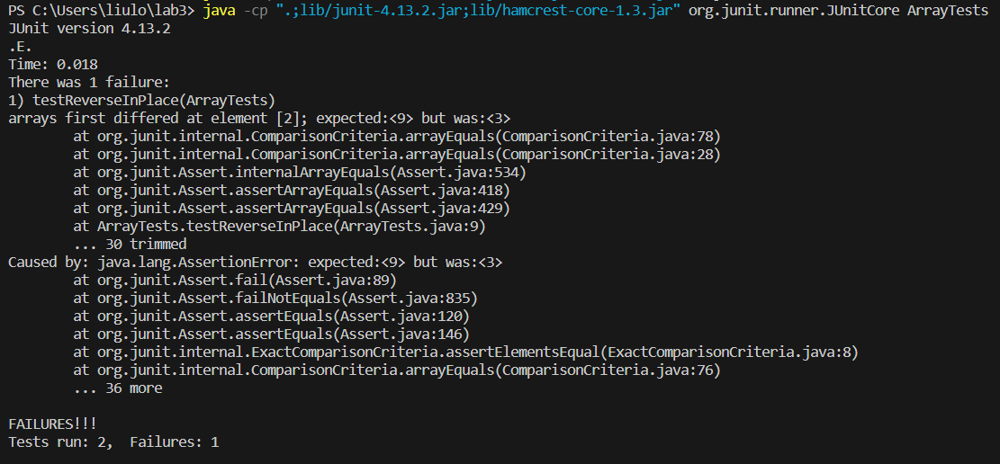
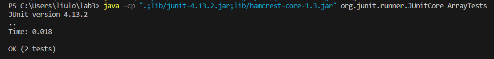

# Part 1:

For part 1, I picked the bug in reverseInPlace() of ArrayExamples.java. 

This is my input for failure:

    public void testReverseInPlace() {
    int[] input1 = { 56,9 };
    ArrayExamples.reverseInPlace(input1);
    assertArrayEquals(new int[]{ 9,56 }, input1);
	}

 And input with no failure:

     public void testReverseInPlace() {
    int[] input1 = { 56 };
    ArrayExamples.reverseInPlace(input1);
    assertArrayEquals(new int[]{ 56 }, input1);
	}

Here are the screenshots of the pass/fail tests:

This is the code that is causing the problem:

    for(int i = 0; i < arr.length; i += 1) {
      arr[i] = arr[arr.length - i - 1];
    }
This is the code I used to fix the bug:
     
     int n = arr.length;  
     for(int i = 0; i < n / 2; i++){
      int temp = arr[i];
      arr[i] = arr[n - i - 1];
      arr[n - i - 1] = temp;
    } 
# Part 2:

For part 2, I picked the "find" command. 

	$ find -name "*.java"
