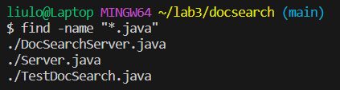
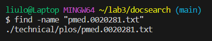
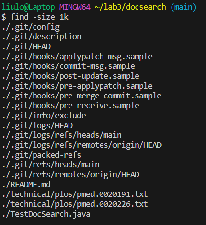
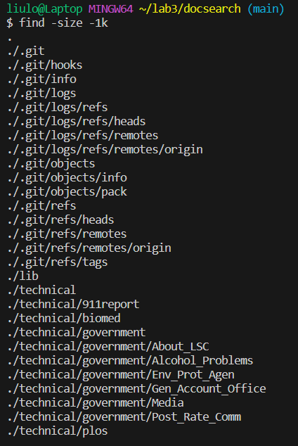

# Part 1:

For part 1, I picked the bug in reverseInPlace() of ArrayExamples.java. 

This is my input for failure:

    public void testReverseInPlace() {
    int[] input1 = { 56,9 };
    ArrayExamples.reverseInPlace(input1);
    assertArrayEquals(new int[]{ 9,56 }, input1);
	}

 And input with no failure:

     public void testReverseInPlace() {
    int[] input1 = { 56 };
    ArrayExamples.reverseInPlace(input1);
    assertArrayEquals(new int[]{ 56 }, input1);
	}

Here are the screenshots of the pass/fail tests:

This is the code that is causing the problem:

    for(int i = 0; i < arr.length; i += 1) {
      arr[i] = arr[arr.length - i - 1];
    }
This is the code I used to fix the bug:
     
     int n = arr.length;  
     for(int i = 0; i < n / 2; i++){
      int temp = arr[i];
      arr[i] = arr[n - i - 1];
      arr[n - i - 1] = temp;
    } 
# Part 2:

For part 2, I picked the "find" command. 

-name:

	$ find -name "*.java"
 	        or	
	$ find -name "pmed.0020281.txt"

The "find -name" command is useful when you want to search for files based on the specific names. It will print the result of the file locations.

-type:

	$ find -type f
 	       or
 	$ find -type d
The "-type" command is useful when you want to list all files in a directory and sub-directory. "find -type d" will list all the sub-directories. 

-size:

	$ find -size 1k	
 	       or
	$ find -size -1k

The "-size" option is useful when you want to list the files based on their size, we can also use the "+ or -" signs in front of the size as greater than the size or less than the size.

-mtime:

	$ find -mtime -1
 	      or
	$ find -mtime +30
 The "-mtime" will list the files based on the modification time. The number behind the command indicates the number of days. 

The website I used to find all the infomation: [https://tecadmin.net/linux-find-command-with-examples/].
