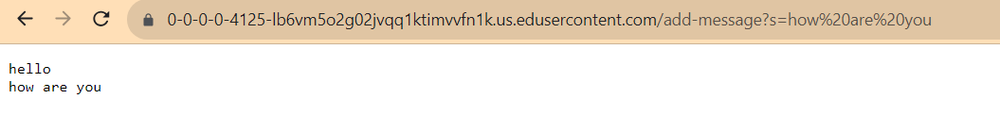

# Part 1:

I first used StringBuilder() to create a string to store all the words added. Then getPath() and contains() to see if the URL contains the word "/add-messages". Used split() to separate the URL. And replaceAll() to replace the "+" to " ". Then used append() to store the word into the string, and last used toString() to print it on the screen. 

# Part 2:

For part 2, I picked the bug in reverseInPlace() of ArrayExamples.java. 

This is my input for failure:

    public void testReverseInPlace() {
    int[] input1 = { 56,9 };
    ArrayExamples.reverseInPlace(input1);
    assertArrayEquals(new int[]{ 9,56 }, input1);
	}

 And input with no failure:

     public void testReverseInPlace() {
    int[] input1 = { 56 };
    ArrayExamples.reverseInPlace(input1);
    assertArrayEquals(new int[]{ 56 }, input1);
	}
