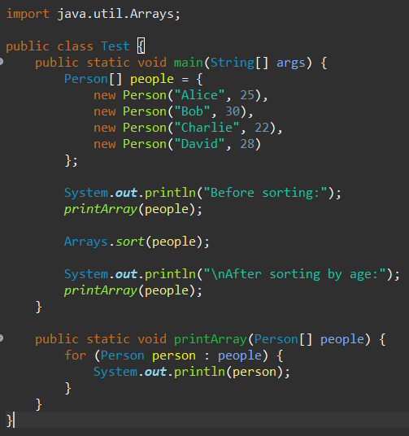

# Part 1:

```
Title: Help Needed - Unexpected Output in Java Program

Hey everyone,

I'm currently working on a class assignment. I've attached a screenshot of the code and the output below. The program is supposed
to sort the elements in an array, but the result is not what I expected and it seems to be in a reversed order. I've reviewed my
code, and I'm stuck.
Can someone please take a look?

```



