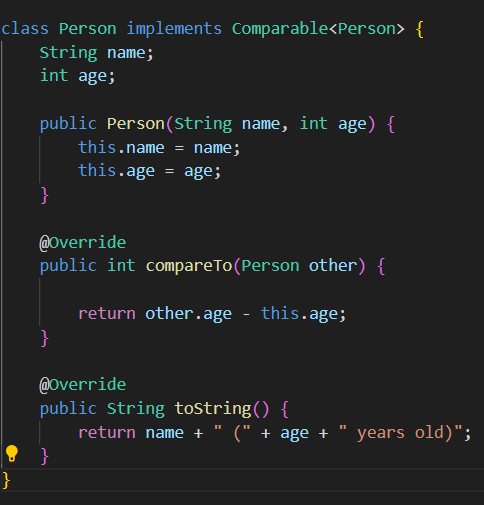

# Part 1:

Initial post:

```
Title: Help Needed - Unexpected Output in Java Program

Hey everyone,

I'm currently working on a class assignment. I've attached a screenshot of the code and
the output below. The program is supposed to sort the elements in an array, but the
result is not what I expected and it seems to be in a reversed order. I've reviewed my
code, and I'm stuck. Can someone please take a look and help me make it sorting the
elements in ascending order? Thank you.
```



TA response:

```
Hi there! Thanks for reaching out.  It looks like the issue might be related to the way you're comparing two elements, check
your compareTo() method and see if that can fix your problem. 
```

My response:

```
You are right about my compareTo() method, the return statement is wrong and made the result in revered order. 
I made some changes(swap "this" and "other" in the return statement) to the compareTo() method and it fixed the issue. See
below for the change and result. Thank you!
```


At the end:
For this scenario, I used two java files: Test.java which has the main method and the inputs, and PersonSorter.java which has the ```compareTo()``` method. Both files are in the home/lab3/Lab5 directory. I put the ```javac``` and ```java``` commands in the test.sh so I can use ```bash test.sh```to easily compile and run the test after I make changes. What I did to fix the bug was I swapped the words "this" and "other" in the return statement of ```compareTo()``` method. 


# Part 2:

Things I learned from the second half of this course: useful Linux commands, how to use Vim to edit text, how to use the debugger, how to add a new SSH key, and how to push to GitHub, etc.


