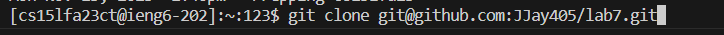
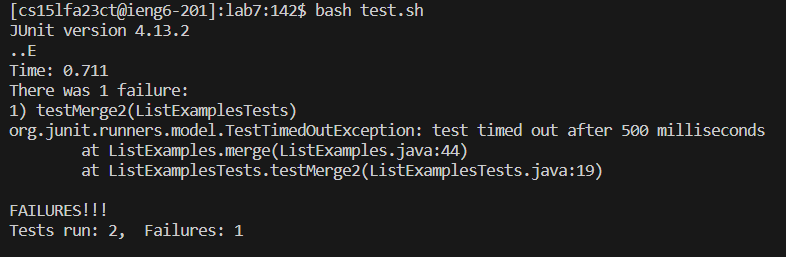
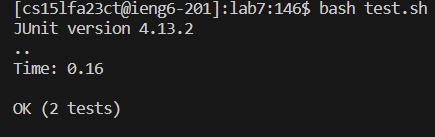
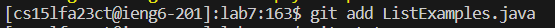
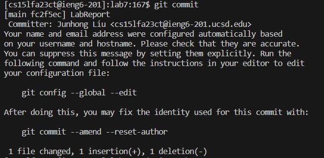
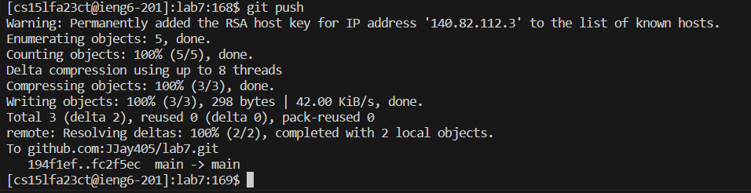

 Keypressed: 
 1. ```<up> <enter>```  command: ```ssh cs15lfa23ct@ieng6.ucsd.edu``` was 1 command up from search history, used the up arrow to access it.

    

2. ```<up><up><up><up><up><up> <enter>``` command ```git clone git@github.com:JJay405/lab7.git``` was 6 command up from search history, used the up arrow to access it.

    

3. ```<c><d><space><l><a><b><7> <enter>```   enter ```cd lab7``` to get into the lab7 directory.

    

4. ```<b><a><s><h><spaca><t><e><s><t><.><s><h> <enter>   enter ```bash test.sh``` to run the test.

   

5.```<up><up><up><up> <enter>``` command: ```vim ListExamples.java``` was 4 command up from search history, used the up arrow to access it. 


6. ```<x><i><2><esc><:><w><q> <enter> ``` when using vim to open the ```ListExamples.java``` file, the cursor is already at the '1', so I just changed it to '2' without moving around the cursor.
   

7. ```<up><up><up> <enter> ``` command: ```bash test.sh``` was 3 command up from search history, used the up arrow to access it. 
   
  

8. ```<up><up><up><up><up><up><up> <enter> ``` command: ```git add ListExamples.java``` was 7 command up from search history, used the up arrow to access it.

    

9. ```<g><i><t><space><c><o><m><m><i><t> <enter>``` enter ``` git commit ```, then ```<i><L><a><b><R><e><p><o><r><t> <Esc><:><w><q> ``` open vim, edit commit message, save and quit.

    

10.```<g><i><t><space><p><u><s><h> <enter> ```   enter ```git push ``` push it to Github.


