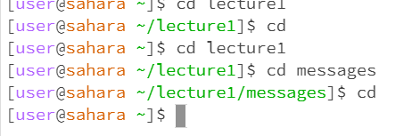
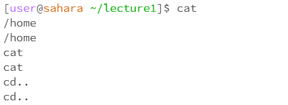
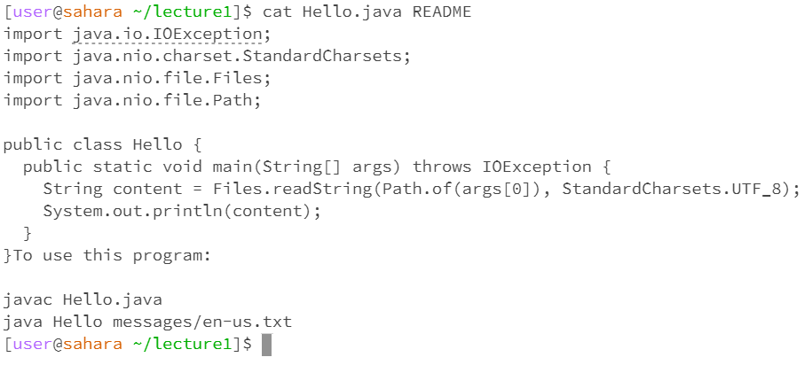

For the "cd" command(Change Directory), when running "cd lecture1" in the home directory, it switches the working directory to lecture1, when running "cd messages" in the lecture1 directory, it switches the working directory from lecture1 to the messages, when running "cd" in any working directory, it switches the current working directory to the home directory.

For the "ls" command(List), when running "ls" in any working directory, it lists the files and folders in the current directory. In the home directory, when running "ls lecture1", it lists all files and folders in lecture1 folder. In the home directory, when running "ls messages", the system will show an error because messages is not in the home directory, in order to list messages, we have to cd to the lecture1 folder first, then run "ls messages".        

For the "cat" command(Concatenate), when running"cat" alone, it starts to echo whatever I type in the command line as input. We have to use Ctrl+D to exit "cat". 

When running "cat" command with a path, it prints out the contents of that file.
